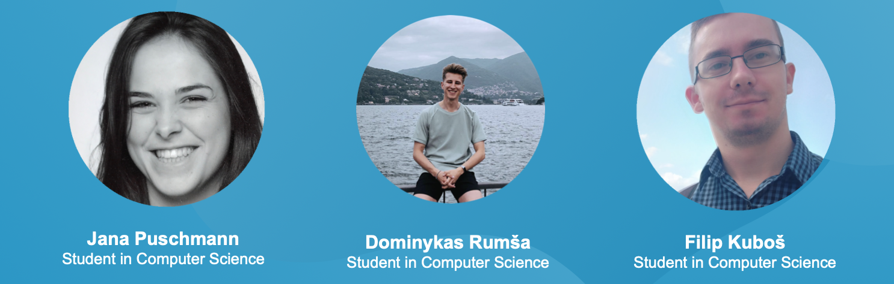

## Interdisciplinary Digital Entrepreneurship

[Week3](./README.md) &ensp;&ensp;&ensp; [Week4](case_work/week4.md) &ensp;&ensp;&ensp; [Week5](case_work/week5.md) &ensp;&ensp;&ensp; [Week6](case_work/week6.md) 
&ensp;&ensp;&ensp; [Week7](case_work/week7.md) &ensp;&ensp;&ensp; [Week8](case_work/week8.md) &ensp;&ensp;&ensp; [Week9](case_work/week9.md) &ensp;&ensp;&ensp; [Week11](case_work/week11.md)

This is our group page for the course Interdisciplinary Digital Entrepreneurship at the Aarhus University (2020/21).

### Group

- Jana Puschmann
- Filip Kubos
- Dominykas Rumsa

### Picture

### Idea generation 
#### Bird-in-hand
- Filip 
  * Studies masters degree in Computer Science 
  * Likes machine learning and data mining
- Dominykas 
  * Studies masters degree in Computer Science 
  * Likes web design and the design of good user experiences 
- Jana 
  * Studies masters degree in Computer Science 
  * Likes data visualization and data analysis 
  
