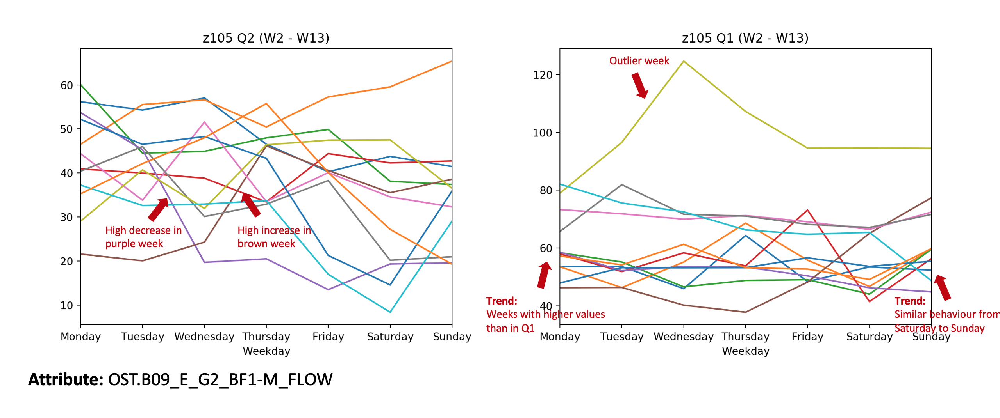
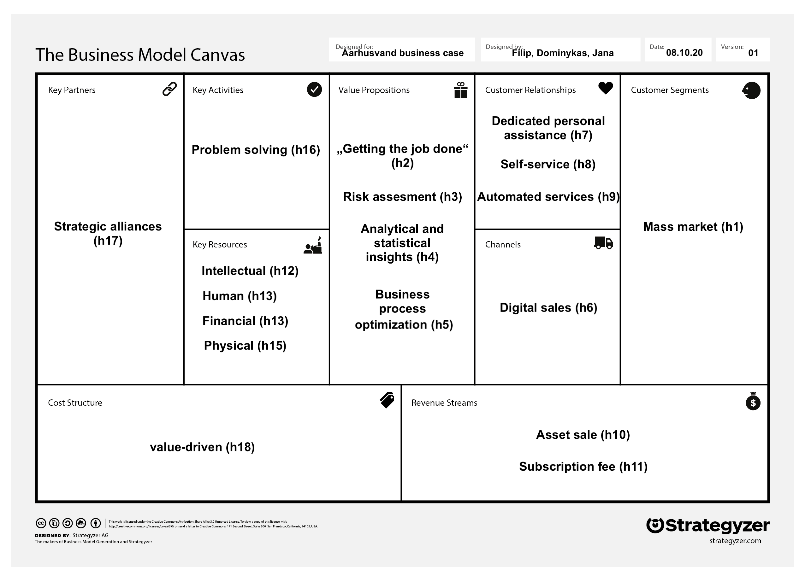

## Interdisciplinary Digital Entrepreneurship

This is our group page for the course Interdisciplinary Digital Entrepreneurship at the Aarhus University (2020/21).

### Group

- Jana Puschmann
- Filip Kubos
- Dominykas Rumsa

------

### Experiments - 02.10.20

| Hypothesis        | Experiment           | Difficulty  |  Result |
| ----------------- |:--------------------|:-----------:| ------- |
| People consume more water during the weekends than during the week | Analyse data | easy | Data set with annotated weekday and week number which can be used to plot each week for a certain attribute |
| People consume more water during public holidays than during weekdays | Analyse data | easy |         |
| People consume more water during the corona-related isolation time | Analyse data | easy | Starting from week 11 to week 16 (start of the lockdown) there was a sharp increase in water flow |
| People consume more water in the summer than in the winter time | Analyse data | easy | Significant increase in water consumption during summer |
| Some data attributes are more stable than others (some attributes fluctuate more than others) | Analyse data and contact aarhusvand for more information on the data attributes | intermediate |         |
| People consume more water on hot days than cold days | Analyse data and relate to weather data | intermediate |         |
| There are certain dates that can be linked to real-world events that influenced that water consumption [1]| Analyse data and find possible real-world connection | hard |         |

[1]: https://www.dst.dk/

#### Experiment 1 - Increase of water consumption on the weekend

The first experiment was meant to try to find out whether there would be a significant difference between the water consumption on the weekends compared to regular weekdays. The thought was that people generally are at home during the weekend which could lead to a higher consumption of water. 

The given data contains logs of certain attributes over two quarters (6 months). That data is logged for every minute, each day. This is too much data too visualize in an understanding way, so the first thing we did was to compute the mean value for every attribute each day. This leaves us with only one value per day instead of several thousand.

We visualized the given data by aarhusvand by splitting it into weeks and plotting it for the available quarters Q1 and Q2. This approach is far from perfect and unfortunately the time for fine tuning this visualization was missing. However, we can already observe that there are some interesting details in the plots. It seems that there generally can be observed an increase from Saturday to Sunday in the data in both quarters. We are still unsure what the attributes in the data actually mean and need to contact aarhusvand to get some more insights on why we might observe an increase in this particular attribute. It is also important to mention that this is only 1 of 19 of the given attributes in the data set. We can also find an interesting outlier in the first quarter (s. brown line in q1) that is deviates a lot from the other weeks and a week that suddenly starts to decrease (s. purple line in q1) as well. Once we annotate the lines with the corresponding week numbers, it will be easy to have a closer look at outlying data like this.

Even though that was not the goal of this experiment, we can see a slight increase in the overall values in both data sets when we compare Q2 to Q1. This might be an indication that warmer months do influence the water consumption somehow. To proof this, we would need to have a look at the other available attributes and get a better understanding about what they describe.

Overall, an overview like this could make it much easier for a data scientist to understand whether the current week deviates from the norm in certain attributes. This could be one of multiple views in a data visualization dashboard.

#### Experiment 2

#### Experiment 3

This experiment tries to give insights for water flow increase during lockdown period due to Covid-19. Lockdown in Denmark started on March 13th (week 11) and lasted approximately until June 8th (week 24) when phase 3 was introduced. This graph represents water flow data grouped by week for one of the available attributes in data set DIS.01_H_B96_BF1-M_FLOW_MID. It is clearly visible that starting from week 11 there is a sharp increase in water flow amount, thus confirming the initial hypothesis that water flow increase during lockdown period. However, further research needs to be carried out on the remaining data set and consultancy with domain experiments is required to fully confirm these claims.

------

### Business model canvas - 09.10.20

#### CUSTOMER SEGMENTS
- __h1:__ Customers or individuals with large amounts of data are willing to use our product for data analysis and procession *(mass market)*

#### VALUE PROPOSITIONS
- __h2__: We help the customer getting the job of data analysis done efficiently by providing the visual analytic tool for their data *("Getting the job done")*

- __h3__: Customer gets the potential to forsee upcoming risks by using our tool *(Risk assessment)*

- __h4__: Customers decision making process will be much easier and more efficient using our product *(Analytical and statistical insights)*

- __h5__: Customers using our products spend less time and money for analysing the data *(Business process optimization)*

#### SALES CHANNELS
- __h6__: Users are willing to use the digital platform that we provide to request our services *(Digital sales)*

#### CUSTOMER RELATIONSHIPS
- __h7__: Customers want a product thats tailored according to their needs and a person that will be their personal contact throughout the process of creating the process  *(Dedicated personal assitance)*

- __h8__: Customers want to be provided with a manual (how-to) that they could use the product without additional assistance *(Self-service)*

- __h9__: Customers want to get automated reports (e.g. weekly) to get further insights on their data *(Automated services)*

#### REVENUE STREAMS
- __h10__: Customers want to buy their individual product for a one time fee *(Asset sale)*

- __h11__: Customers are willing to pay a subscribtion fee for further maintenance of the product *(Subscribtion)*

#### KEY RESOURCES
- __h12__: Customer knowledge (domain knowledge) and database is required in order to carryout our research and provide insights or value *(Intellectual)*

- __h13__: In order to create the product we need skilled employess in data sience and in the area of data visualization, communication, sales and management *(Human)*

- __h14__: To start product development we need employ workers *(Financial)*

- __h15__: To keep our provided services accessible we need a data server, hardware for the employees and computing power *(Physical)*

#### KEY ACTIVITIES
- __h16__: Customers need our expertise to bring the data into readable and interpretable format *(Problem solving)*

#### KEY PARTNERSHIPS
- __h17__: We need to collaborate with cloud providers to reduce the price of computing and storage resources *(Strategic alliences)*

#### COST STRUCTURE
- __h18__: We want to create the best product that brings the most value for the customers business process *(Value driven)*

### Experiments

| Hypotheses        | Experiment          | Difficulty   |  Result  |
| ----------------- |:--------------------|:-----------:| -------- |
| h1 | Identify potential clients and interview them to figure out if this product would create value for them | Normal |  |
| h2 | A prototype of data visualisation is created and presented for customer to gain feedback if this visualisation would solve some of the existing customer’s problems | Easy | |
| h3 | Share success stories with customers where we would highlight how our product helped in identifying potential pitfalls for other customers | Easy | |
| h4, h5 | Aquire different metrics and compare it to the ones before customer started using this product, highlight the positive findings | Hard | |
| h6 | Create a web version of the product for desktop/mobile and gather feedback from target groups | Hard | |
| h9 | Send a draft version of data report for customers and collect feedback | Easy |  |
| h10 | Do a research on existing products alike, set a competitive price and valuate it on customer satisfaction level | Hard | |
| h11 | Create a more general product and release it for a monthly fee and track customers retention over time | Hard |  |
| h12 | Carry out a research without any input from customer and see how accurate were the results and did they brought any value | Normal |  |
| h13 | Try to acquire student workers, apply their competencies and see how well the product or service is growing on different metrics | Normal |  |
| h14 | Try tackling development tasks in between the co-founders and see if our competencies are enough to create MVP | Hard |  |
| h16 | Aquire a sample dataset from customer and showcase what could be done and present it in an easy to understand manner | Normal |  |
| h17 | Try using different services providers, compare the costs and feature set and pick a most appropriate solution | Hard |  |
| h18 | Weekly/monthly/annually feedback sessions with the customer about discussing existing features, what could be added, what’s missing etc | Normal |  |

