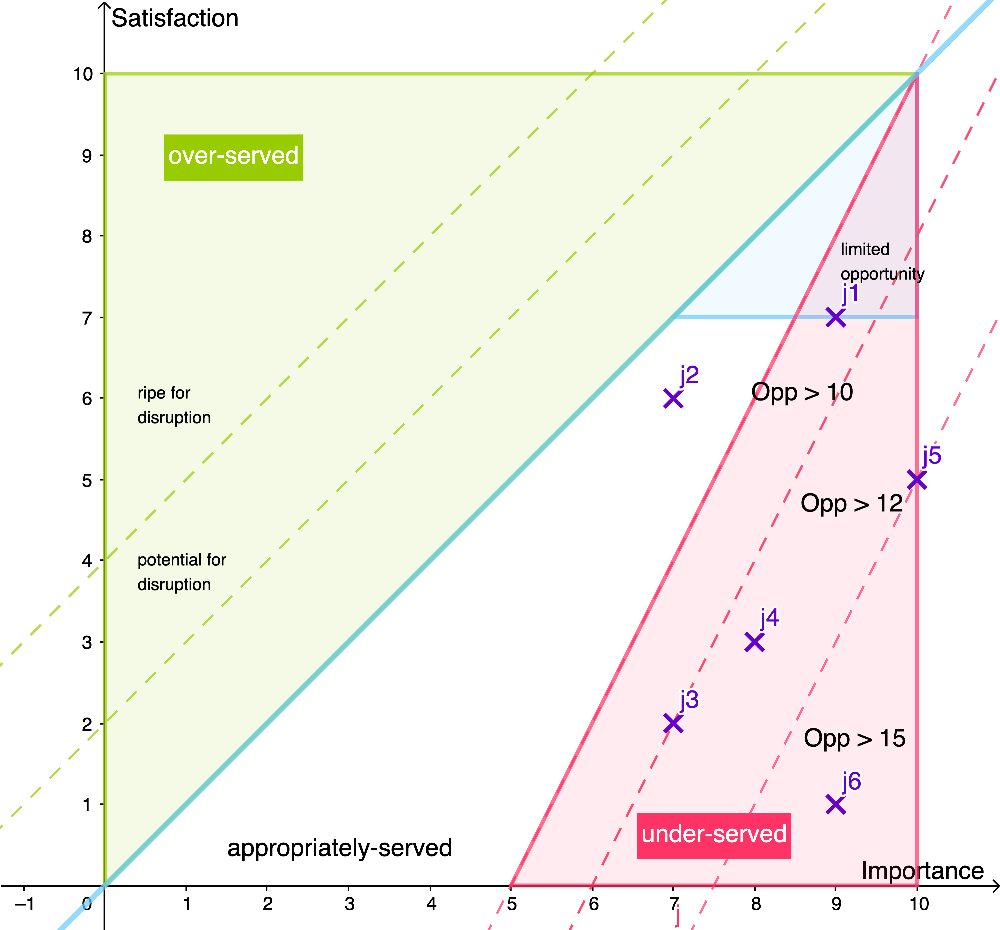

## Interdisciplinary Digital Entrepreneurship

[Week3](../README.md) &ensp;&ensp;&ensp; [Week4](./week4.md) &ensp;&ensp;&ensp; [Week5](./week5.md) &ensp;&ensp;&ensp; [Week6](./week6.md)
&ensp;&ensp;&ensp; [Week7](./week7.md) &ensp;&ensp;&ensp; [Week8](./week8.md) &ensp;&ensp;&ensp; [Week9](./week9.md) &ensp;&ensp;&ensp; [Week11](./week11.md)

### ODI - 25.09.20

- Who is the customer? 
  * Companies that need to maintain their own water pipelines and that gather a sufficient amount of data doing so (e.g. aarhusvand)
- What job(s) do you try to carry out in relation to your idea?
  * Identify and analyse interesting or deviating data in the real-time flow (j1),
  * Compare the water consumption (e.g.  this years consumption during a pandemic comparedto last years consumption) (j2),
  * Find correlation between spikes or lows in the data and real-life events (e.g.  water consump-tion during local festivals) (j3),
  * Predict the future water consumption (j4),
  * Detect leaking pipes (j5),
  * Predict the probability of a pipe leakage (j6)
- Which needs have you identified and have you found unsatisfied needs? 
  * Predictive maintenance 
    - We did not get the chance to talk to the experts from aarhusvand, however, our research revealed that there exists no sufficient solution to predict future pipe leakage 
  * Predictive consumption 
    - From the business case provided by aarhusvand we gathered that the need of analysing and predicting consumption in relation to real-life events is still under-served
- Create and opportunity landscape diagram. Reflect about the model qualities in relation to your idea. 

- Did you acquire new insights? 
  * We think that visualizing the opportunity landscape using the notion of importance and satisfaction actually helps to see which jobs actually make sense to focus on the most. It might turn out to focus on something that is less important but not satisfied than to go for something that is important but has a somewhat satisfactory solution. Of course it's always the best when you find jobs that are important and almost not satisfied. 
- Was it hard to apply? 
  * However, this also means that you need to be able to quantify these attributes in a plausible way which requires a good understanding of the customers workflow and needs. Different positions might quantify importance of jobs differently because they are either more or less affected by the outcome. It is probably a good idea to get input from different teams and employees and to work with a domain expert that has knowledge about the whole procedure. 
