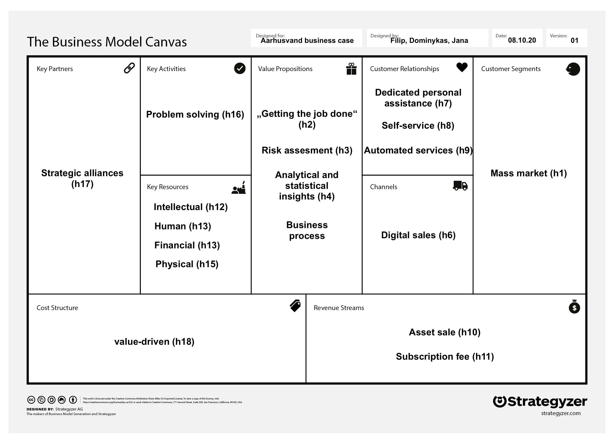

## Interdisciplinary Digital Entrepreneurship

[Week3](../README.md) &ensp;&ensp;&ensp; [Week4](./week4.md) &ensp;&ensp;&ensp; [Week5](./week5.md) &ensp;&ensp;&ensp; [Week6](./week6.md)
&ensp;&ensp;&ensp; [Week7](./week7.md) &ensp;&ensp;&ensp; [Week8](./week8.md)

### Business model canvas - 09.10.20

#### CUSTOMER SEGMENTS
- __h1:__ Customers or individuals with large amounts of data are willing to use our product for data analysis and procession *(mass market)*

#### VALUE PROPOSITIONS
- __h2__: We help the customer getting the job of data analysis done efficiently by providing the visual analytic tool for their data *("Getting the job done")*

- __h3__: Customer gets the potential to forsee upcoming risks by using our tool *(Risk assessment)*

- __h4__: Customers decision making process will be much easier and more efficient using our product *(Analytical and statistical insights)*

- __h5__: Customers using our products spend less time and money for analysing the data *(Business process optimization)*

#### SALES CHANNELS
- __h6__: Users are willing to use the digital platform that we provide to request our services *(Digital sales)*

#### CUSTOMER RELATIONSHIPS
- __h7__: Customers want a product thats tailored according to their needs and a person that will be their personal contact throughout the process of creating the process  *(Dedicated personal assitance)*

- __h8__: Customers want to be provided with a manual (how-to) that they could use the product without additional assistance *(Self-service)*

- __h9__: Customers want to get automated reports (e.g. weekly) to get further insights on their data *(Automated services)*

#### REVENUE STREAMS
- __h10__: Customers want to buy their individual product for a one time fee *(Asset sale)*

- __h11__: Customers are willing to pay a subscribtion fee for further maintenance of the product *(Subscribtion)*

#### KEY RESOURCES
- __h12__: Customer knowledge (domain knowledge) and database is required in order to carry out our research and provide insights or value *(Intellectual)*

- __h13__: In order to create the product we need skilled employees in data sience and in the area of data visualization, communication, sales and management *(Human)*

- __h14__: To start product development we need to employ workers *(Financial)*

- __h15__: To keep our provided services accessible we need a data server, hardware for the employees and computing power *(Physical)*

#### KEY ACTIVITIES
- __h16__: Customers need our expertise to bring the data into readable and interpretable format *(Problem solving)*

#### KEY PARTNERSHIPS
- __h17__: We need to collaborate with cloud providers to reduce the price of computing and storage resources *(Strategic alliences)*

#### COST STRUCTURE
- __h18__: We want to create the best product that brings the most value for the customers business process *(Value driven)*

### Experiments

| Hypotheses        | Experiment          | Difficulty   |  Result  |
| ----------------- |:--------------------|:-----------:| -------- |
| h1 | Identify potential clients and interview them to figure out if this product would create value for them | Medium |  |
| h2 | A prototype of data visualisation is created and presented for customer to gain feedback if this visualisation would solve some of the existing customer’s problems | Easy | |
| h2 | Get insights of customers current data analysis process and compare to the process with our solution | Medium | |
| h3 | Share success stories with customers where we would highlight how our product helped in identifying potential pitfalls for other customers | Easy | |
| h3 | Ask customers to report findings that surprised them and that they would not have found in the old process | Medium | | 
| h4, h5 | Aquire different metrics and compare it to the ones before customer started using this product, highlight the positive findings | Hard | |
| h6, h16 | Create a web version for the business concept for desktop/mobile and wait for requests by possible customers | Hard | |
| h6, h16 | Advertise the company webpage and analyse the traffic, engagement and number of requests | Hard | | 
| h7 | Try different versions of customer support on the customers and ask them for their feedback | Medium | |
| h8 | Gather feedback from the customer on the user experience, most likely customers will get back to us with questions that will make it easier to generate such manual | Medium |  |
| h9 | Send a draft version of data report for customers and collect feedback | Easy |  |
| h10 | Do a research on existing products alike, set a competitive price and evaluate it on customer satisfaction level | Hard | |
| h11 | Create a more general product and release it for a monthly fee and track the customers engagement over time | Hard |  |
| h11 | Simply give customer the choice to pay for the maintanance of the product by using the subscription model or by paying for every new fix (e.g. changing data model, etc.) | Easy | | 
| h12 | Carry out research without any input from the customer and see how accurate the results were and whether they brought any value | Medium |  |
| h13 | Try to acquire student workers, apply their competencies and see how well the product or service is growing on different metrics | Medium |  |
| h14 | Try tackling development tasks in between the co-founders and see if our competences are enough to create MVP | Hard |  |
| h15 | Start with existing hardware (e.g. personal computers, etc.) and upgrade only if necessary and iterate the process | Easy | | 
| h16 | Aquire a sample dataset from customer and showcase what could be done and present it in an easy to understand manner | Medium |  |
| h17 | Try using different services providers, compare the costs and feature set and pick a most appropriate solution | Hard |  |
| h18 | Weekly/monthly/annually feedback sessions with the customer about discussing existing features, what could be added, what’s missing etc | Medium |  |

