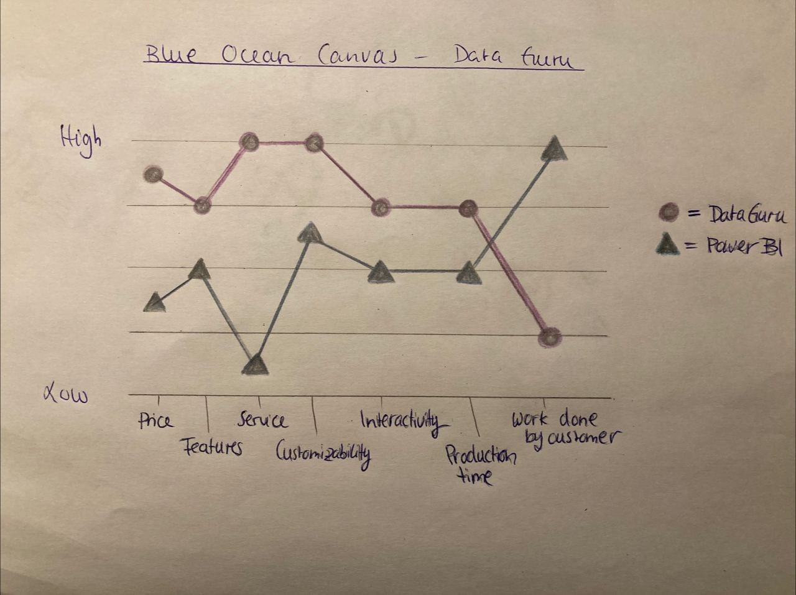

## Interdisciplinary Digital Entrepreneurship

[Week3](../README.md) &ensp;&ensp;&ensp; [Week4](./week4.md) &ensp;&ensp;&ensp; [Week5](./week5.md) &ensp;&ensp;&ensp; [Week6](./week6.md)
&ensp;&ensp;&ensp; [Week7](./week7.md)

### Bold strategies - 23.10.20

#### Types of Monopolies

| Type of monopoly  | How to achieve it   | Rated approach (1-4)  |
| ----------------- |:--------------------|:-----------:|
| Proprietary technology | Create an efficient machine learning algorithm that helps getting quick and easy insights into the customers data. Building a framework that makes it easier to create new visualizations based on the work that has already been done so that competitors can not easily recreate the results or at least not as fast as we can. | 3 |
| Network effects | Cater to as many employees of a company as possible so that there is no need to switch to alternative products when our product can be used in several deparments (intra-company network effect). Make the product more accessible so that people can just try it out without a lot of hastle, this might mean that a lot of the personal aspects are cut. | 4 |
| Economies of scale | Create a base framework for all the solutions that can be created for the customers that way employees will save time after an initial set-up such that development will be faster. It is not as efficient as with other software products but will still save time and money to adjust the framework rather than create a whole new product from scratch. | 2 |
| Branding | Consumers might need to spend more money than for self-service solutions such as Power BI or Tableau, however, they get premium quality solutions, customized service and expertise in the field of visualization. By offering real time customer service our company could stand out from its competitors.  | 1 |

#### If you were to create a monopoly in a market what could be a good first market to address and why?
We think it could be a good way to start with small, independent business that lack the resources to do their own data analysis and visualization. They might not want to hire a person specifically long-term to create such a solution for them. This would help us start small, to learn to create small visual solutions and start creating a framework to simplify work later on. The advantage of small companies is that they most likely have needs on a smaller scale and complexity. In addition to this, smaller companies have a closer relationship to other companies or clients, thus success stories shared by our clients could attract more potential users because the recommendation would be more personal or trustworthy.

#### Blue Ocean Canvas

